# Introdução

Informações básicas do projeto.

* **Projeto:** Spotlight
* **Repositório GitHub:** https://github.com/ICEI-PUC-Minas-CC-TI/ti1-2025-1-t2-manha-spotlight.git
* **Membros da equipe:**

  * [Ana Julia Santos Leite](https://github.com/AnaJuliaSantosLeitos)
  * [Filipe Totaro Bruekers](https://github.com/lipebrks)
  * [Gabriel Teodoro Gomes](https://github.com/GabrielTeodoruh)
  * [Guilherme Mafort Starling](https://github.com/guiMafort)
  

A documentação do projeto é estruturada da seguinte forma:

1. Introdução
2. Contexto
3. Product Discovery
4. Product Design
5. Metodologia
6. Solução
7. Referências Bibliográficas

✅ [Documentação de Design Thinking (MIRO)](files/processo-dt.pdf)

# Contexto

Introdução:
A realização de projetos no campo das artes muitas vezes necessita encontrar um meio termo entre o processo subjetivo da expressão artística criativa e sua viabilidade mercadológica. A entrada no mercado de um artista como um musico ou um fotografo, por exemplo, exige um longo processo não só de formação e capacitação técnica, como também de gerenciamento de networking e publicidade de seu trabalho. 
Embora hoje esse processo de divulgação seja favorecido pelo uso de mídias sociais, os profissionais dentro do meio de cultura (cantores, músicos, artistas plásticos, cinematógrafos) não tem, muitas vezes, uma fonte fixa de renda e vivem de projetos isolados. Em função disso, a conexão e gerenciamento dos artistas com os produtores no networking e um processo essencial para a manutenção das oportunidades de trabalho e renda.

## Problema

**✳️✳️✳️ Embora o número de artistas e produtores tenha crescido significativamente nos últimos anos, o mercado cultural ainda enfrenta um desafio persistente: conectar profissionais com objetivos e visões compatíveis. A falta de plataformas adequadas força produtores a gastar tempo em buscas improdutivas e a arcar com riscos financeiros decorrentes de parcerias desalinhadas artisticamente. Paralelamente, artistas encontram dificuldades para localizar colaboradores que realmente entendam seu potencial e necessidades criativas. Esse desencontro gera projetos com resultados aquém do esperado, custos elevados e relações profissionais instáveis. Como consequência, inúmeras oportunidades se perdem no hiato entre a demanda dos produtores e a oferta de talentos artísticos, enfraquecendo todo o ecossistema cultural. ✳️✳️✳️**

## Objetivos

**✳️✳️✳️ Criar uma plataforma digital que favoreça o processo de conexão entre artistas e produtores. Ao acessar o site, o artista terá acesso a uma serie de projetos em desenvolvimento na sua área, que serão oferecidas pelos produtores. O artista terá a oportunidade de enviar seu portfólio e eventualmente ser contratado, e o produtor por sua vez vai ter no site a facilitação do encontro de mão de obra.
O site ainda será um meio de comunicação entre os membros do projeto, tendo um chat e um sistema de gerenciamento de grupos e subgrupos que ira facilitar a organização dos projetos dos usuários. 
 ✳️✳️✳️**

## Justificativa

**✳️✳️✳️ A plataforma preenche uma lacuna crítica no ecossistema cultural, democratizando o acesso a oportunidades e reduzindo assimetrias de informação — fatores essenciais para a profissionalização do setor.
A ideia de organizar grupos foi também influenciada pela entrevista feita com a produtora e roteirista Sofia Marinho em marco de 2025:
Uma coisa que me incomoda muito, muito mesmo, nos projetos, é que o meio de comunicação hoje é o WhatsApp, não tem como, né? Todo mundo tem seu WhatsApp. Então, por exemplo, começou um projeto novo, aí vai lá e você cria um grupo da produção, um grupo do som, um grupo da fotografia, um grupo do elenco, um grupo do sei o quê, do mesmo projeto, né? Entendi. Isso é um saco, sabe? Queria que tivesse, em algum momento da nossa vida, uma forma de facilitar essas comunicações.
(Marinho Sofia, 2025, grifo nosso)
 ✳️✳️✳️**
 
## Público-Alvo

**✳️✳️✳️ 
•	Artistas independentes (músicos, fotógrafos, cineastas, artistas visuais).
•	Produtores culturais, curadores e gestores de eventos.
•	Coletivos e equipes criativas em busca de colaborações.
 ✳️✳️✳️**

## Etapa de Entendimento

**✳️✳️✳️ APRESENTE OS ARTEFATOS DA ETAPA  ✳️✳️✳️**

##### Matriz CSD e Mapa de Stakeholders 

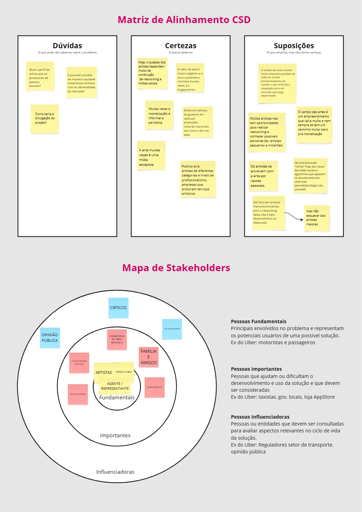

##### Entrevista Qualitativa 1° parte 

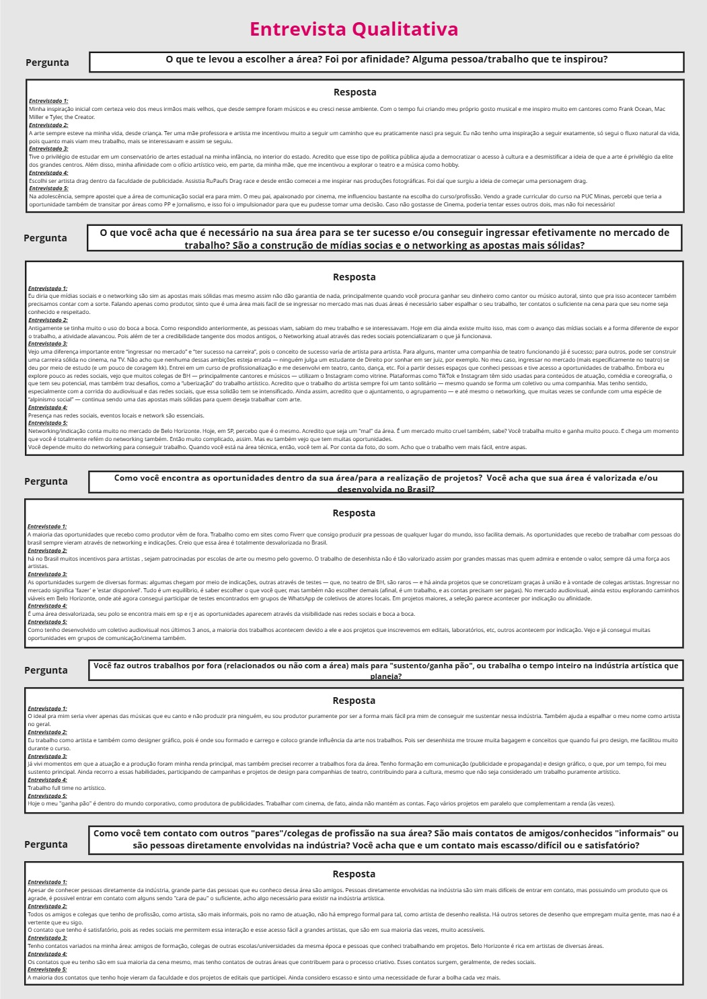

##### Entrevista Qualitativa 2° parte e Highlights

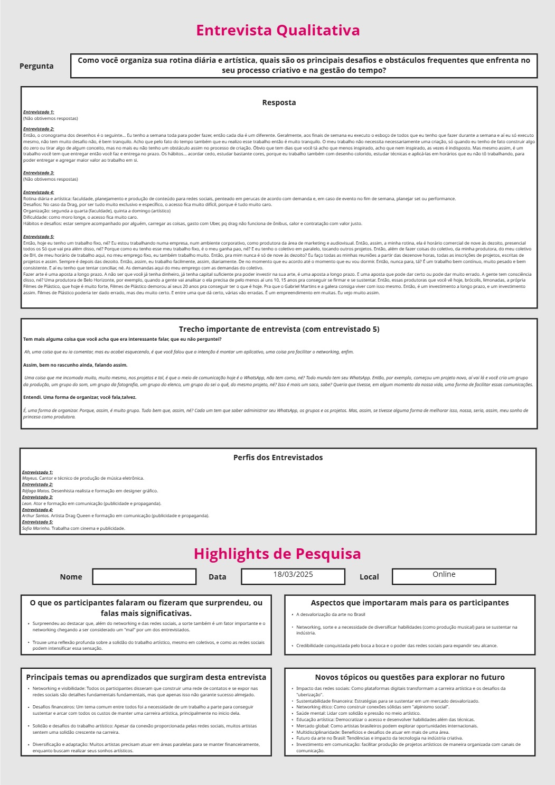


## Etapa de Definição

### Personas

**✳️✳️✳️ 
- Rafael (Persona do Artista e Produtor iniciante)
- Matheus (Persona do Artista e Produtor mais experiente)
- Fernanda Oliveira (Persona do Contratante)
- ArtLink (Persona da Plataforma/Site/App)
- ✳️✳️✳️**

## Histórias de Usuários

Com base na análise das personas foram identificadas as seguintes histórias de usuários:

Aqui está a tabela formatada com as informações das personas:

| EU COMO...`PERSONA` | QUERO/PRECISO ...`FUNCIONALIDADE` | PARA ...`MOTIVO/VALOR` |
|----------------------|------------------------------------|------------------------|
| Artista/Produtor Iniciante | Me conectar a profissionais da minha área e ter visibilidade | Resolver a dificuldade em encontrar oportunidades, causada pela falta de rede estruturada e comunicação ineficaz |
| Artista/Produtor Iniciante | Um espaço acessível para divulgar meu trabalho | Resolver o problema de conquistar público fiel, causado pela falta de conhecimento em marketing e alta concorrência |
| Artista/Produtor Experiente | Centralizar e organizar a comunicação em meus projetos | Evitar a fragmentação em múltiplos grupos de WhatsApp e sobrecarga de informações |
| Artista/Produtor Experiente | Um meio seguro para gerenciar contratos e pagamentos | Resolver problemas de garantias em negociações e pagamentos atrasados |
| Contratante | Simplificar a busca por artistas/produtores confiáveis | Resolver a dificuldade em encontrar profissionais adequados e expandir rede de contatos |
| Plataforma | Oferecer um ambiente digital organizado e confiável | Resolver a fragmentação do mercado e dificuldades de networking na indústria criativa |

## Proposta de Valor

**✳️✳️✳️ APRESENTE O DIAGRAMA DA PROPOSTA DE VALOR PARA CADA PERSONA ✳️✳️✳️**

##### Proposta para Persona 1 

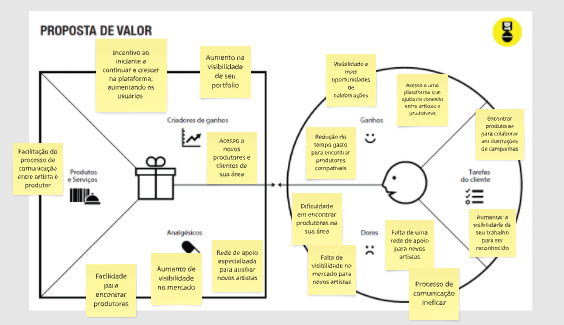

##### Proposta para Persona 2

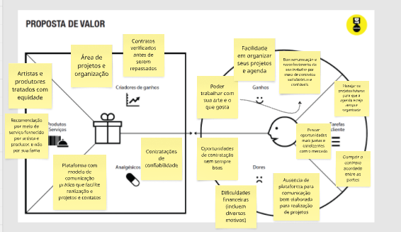

##### Proposta para Persona 3 

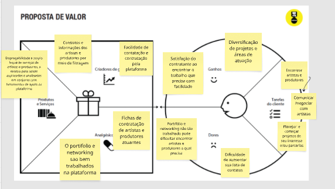

##### Proposta para Persona 4

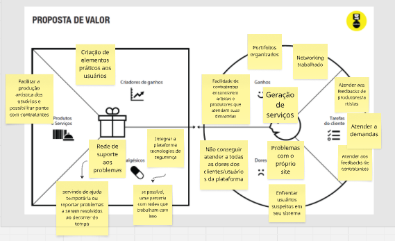

Aqui está a tabela formatada conforme solicitado:

### Requisitos Funcionais

| ID     | Descrição do Requisito                                                                                     | Prioridade |
| ------ | ------------------------------------------------------------------------------------------------------------ | ---------- |
| RF-001 | Permitir a criação de dois tipos de conta: artista/produtor e contratante, com ferramentas diferenciadas     | ALTA       |
| RF-002 | Permitir que contratantes criem eventos para que artistas/produtores acessem informações e se inscrevam     | ALTA       |
| RF-003 | Exigir envio de portfólio quando artistas/produtores se inscrevem em eventos                                | MÉDIA      |
| RF-004 | Permitir filtragem de locais de trabalho para análise de infraestrutura antes de aceitar propostas           | MÉDIA      |
| RF-005 | Oferecer múltiplos canais de comunicação entre usuários para organização de projetos                        | ALTA       |
| RF-006 | Permitir criação de comunidade para interação, compartilhamento de ideias e networking profissional          | BAIXA      |
| RF-007 | Disponibilizar perfil do usuário como portfólio digital com informações e trabalhos                         | ALTA       |
| RF-008 | Permitir vinculação de perfis a plataformas externas (ex: Spotify) para adição de álbuns ao portfólio        | MÉDIA      |
| RF-009 | Permitir categorização de usuários com tags personalizáveis para facilitar buscas                           | MÉDIA      |
| RF-010 | Implementar sistema de avaliação de artistas/produtores por contratantes após eventos                       | ALTA       |
| RF-011 | Fornecer estatísticas de desempenho para artistas/produtores (eventos realizados, feedbacks recebidos)      | BAIXA      |

### Requisitos não Funcionais

| ID      | Descrição do Requisito                                                                 | Prioridade |
| ------- | ---------------------------------------------------------------------------------------- | ---------- |
| RNF-001 | A plataforma deve ser responsiva (mobile, tablet, desktop)                              | ALTA       |
| RNF-002 | Desenvolvimento utilizando HTML e CSS, com disponibilização via GitHub                   | ALTA       |

### Restrições do Projeto

| ID     | Descrição da Restrição                                                                 |
| ------ | ---------------------------------------------------------------------------------------- |
| RES-001| Dificuldades técnicas na integração com plataformas externas (dependência de APIs)       |
| RES-002| Tempo de manutenção elevado devido à complexidade de filtros, ferramentas e ajustes      |

## Projeto de Interface

Artefatos relacionados com a interface e a interacão do usuário na proposta de solução.

### Wireframes

Estes são os protótipos de telas do sistema.

**✳️✳️✳️ Wireframe ✳️✳️✳️**

##### Tela Principal

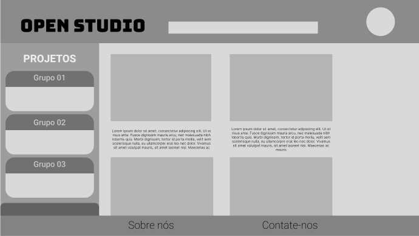

##### Tela do Cadastro

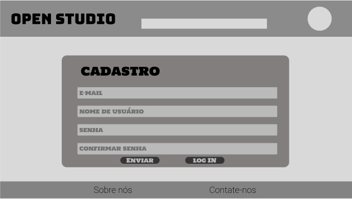

##### Tela do Login

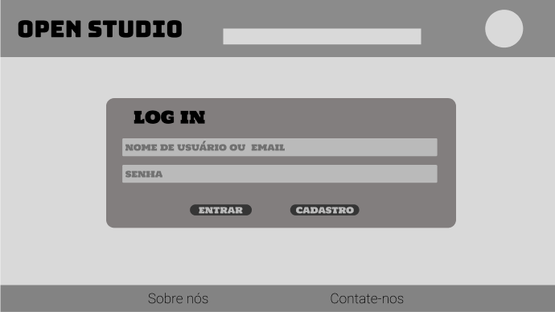

##### Tela do Chat

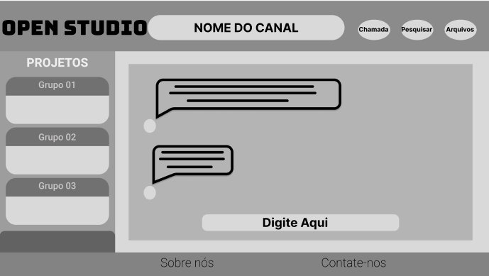

##### Tela do Perfil

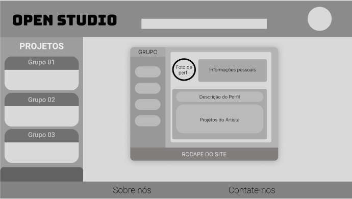

##### Tela dos Detalhes

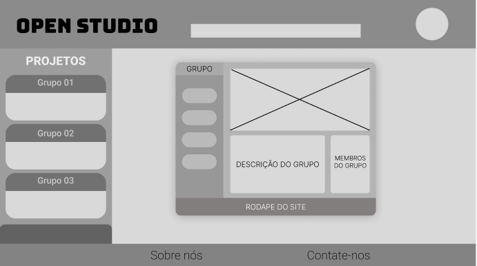

### User Flow

**✳️✳️✳️ 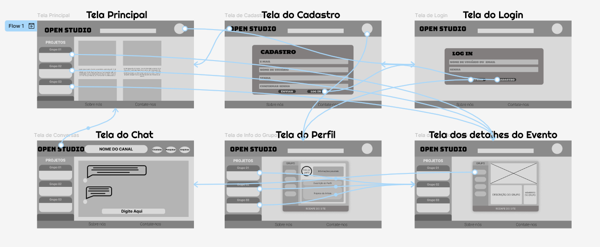 ✳️✳️✳️**

### Protótipo Interativo

**✳️✳️✳️ COLOQUE AQUI UM IFRAME COM SEU PROTÓTIPO INTERATIVO ✳️✳️✳️**

✅ [Protótipo Interativo (Figma)](https://www.figma.com/proto/uQ0EdlGDK7cT2GGH7AHuIC/Wireframe-TI---COMUNIDADE-DE-ARTISTAS-E-PRODUTORES?node-id=15-9&p=f&t=j5LUTP3P8sqqbsBV-1&scaling=min-zoom&content-scaling=fixed&page-id=0%3A1&starting-point-node-id=15%3A9)

# Metodologia

Detalhes sobre a organização do grupo e o ferramental empregado.

## Ferramentas

Relação de ferramentas empregadas pelo grupo durante o projeto.

| Ambiente                    | Plataforma | Link de acesso                                     |
| --------------------------- | ---------- | -------------------------------------------------- |
| Processo de Design Thinking | Miro       | https://miro.com/welcomeonboard/dDNEVEMyQ21FeFZuK1RRZzFleldqQnYrWDlUWTIzbmtVTDlCaWJnNU04SHBQK1dNU0ZwZ3BRTXl0dFZSdkVwR04yZTFTQjZTT2kya0FWQUJ4S05wVVR5Vi8yamtSUkdNNHF1ME5zYVhpQTNlSHUxVDNjOHFJVTV1dUNiZEpQU0JBS2NFMDFkcUNFSnM0d3FEN050ekl3PT0hdjE=?share_link_id=269687455722       |
| Repositório de código     | GitHub     |   https://github.com/ICEI-PUC-Minas-CC-TI/ti1-2025-1-t2-manha-spotlight.git    |
| Hospedagem do site          | Replit     |  |
| Protótipo Interativo       | Figma  | https://www.figma.com/proto/uQ0EdlGDK7cT2GGH7AHuIC/Wireframe-TI---COMUNIDADE-DE-ARTISTAS-E-PRODUTORES?node-id=15-9&p=f&t=j5LUTP3P8sqqbsBV-1&scaling=min-zoom&content-scaling=fixed&page-id=0%3A1&starting-point-node-id=15%3A9   |
|                             |            |                                                    |

## Gerenciamento do Projeto

Divisão de papéis no grupo e apresentação da estrutura da ferramenta de controle de tarefas (Kanban).

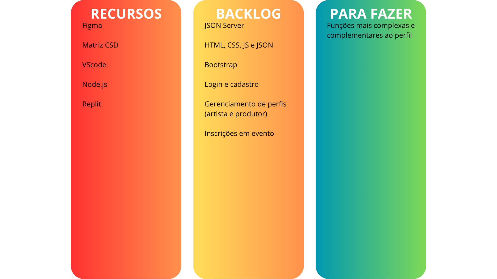
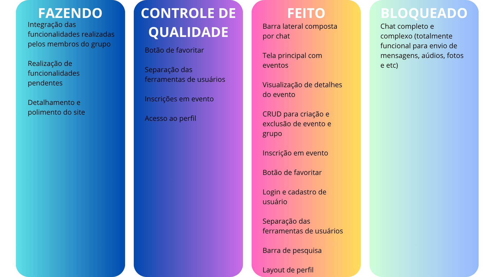

# Solução Implementada

Esta seção apresenta todos os detalhes da solução criada no projeto.

## Vídeo do Projeto

O vídeo a seguir traz uma apresentação do problema que a equipe está tratando e a proposta de solução. ⚠️ EXEMPLO ⚠️

[](https://www.youtube.com/embed/70gGoFyGeqQ)

> ⚠️ **APAGUE ESSA PARTE ANTES DE ENTREGAR SEU TRABALHO**
>
> O video de apresentação é voltado para que o público externo possa conhecer a solução. O formato é livre, sendo importante que seja apresentado o problema e a solução numa linguagem descomplicada e direta.
>
> Inclua um link para o vídeo do projeto.

## Funcionalidades

Esta seção apresenta as funcionalidades da solução.Info

##### Funcionalidade 1 - Cadastro de Contatos ⚠️ EXEMPLO ⚠️

Permite a inclusão, leitura, alteração e exclusão de contatos para o sistema

* **Estrutura de dados:** [Contatos](#ti_ed_contatos)
* **Instruções de acesso:**
  * Abra o site e efetue o login
  * Acesse o menu principal e escolha a opção Cadastros
  * Em seguida, escolha a opção Contatos
* **Tela da funcionalidade**:


> ⚠️ **APAGUE ESSA PARTE ANTES DE ENTREGAR SEU TRABALHO**
>
> Apresente cada uma das funcionalidades que a aplicação fornece tanto para os usuários quanto aos administradores da solução.
>
> Inclua, para cada funcionalidade, itens como: (1) titulos e descrição da funcionalidade; (2) Estrutura de dados associada; (3) o detalhe sobre as instruções de acesso e uso.

## Estruturas de Dados

Descrição das estruturas de dados utilizadas na solução com exemplos no formato JSON.Info

##### Estrutura de Dados - Eventos

Aplicação usada para gerar eventos no sistema

```json
  {
      "id": "1",
      "titulo": "Chamada para Bolsas de Pesquisa em IA",
      "autor": "Universidade XYZ",
      "data": "2025-07-15",
      "local": "São Paulo, SP",
      "imagem": "https://picsum.photos/600/400?random=101",
      "texto": "Estão abertas as inscrições para o programa de bolsas de pesquisa em Inteligência Artificial, com foco em aprendizado de máquina e redes neurais. O programa oferece suporte financeiro e infraestrutura de ponta para projetos inovadores. Os candidatos devem possuir graduação em áreas correlatas e demonstrar experiência prévia em projetos de IA. Mais informações no edital completo.",
      "destaque": true
    }
```

##### Estrutura de Dados - Usuários

Registro dos usuários do sistema utilizados para login e para o perfil do sistema

```json
  {
      "id": "1",
      "nome": "Produtor Exemplo",
      "login": "produtor",
      "senha": "123",
      "email": "produtor@spotlight.com",
      "produtor": true,
      "artista": false,
      "foto": ""
    },
    {
      "id": "2",
      "nome": "Artista Exemplo",
      "login": "artista",
      "senha": "123",
      "email": "artista@spotlight.com",
      "produtor": false,
      "artista": true,
      "foto": ""
    }
```

## Módulos e APIs

Esta seção apresenta os módulos e APIs utilizados na solução

**Images**:
* Lorem Picsum - [https://picsum.photos](https://picsum.photos)

**Fonts:**
* Icons Font Face - [https://fontawesome.com/](https://fontawesome.com/)

**Scripts:**
* Sweetalert2 - [https://sweetalert2.github.io](https://sweetalert2.github.io)
* jQuery - [http://www.jquery.com/](http://www.jquery.com/)
* Bootstrap 5 - [http://getbootstrap.com/](http://getbootstrap.com/)

# Referências

As referências utilizadas no trabalho foram:

* APLAUSOS. Plataforma de Rede Social Musical. Aplausos – Plataforma Musical de Colaboração Online, 2025. Disponível em: https://www.aplausos.net/. Acesso em: 12 março 2025.

* MUSICONNECT.IO. Ecossistema inovador para interação entre músicos, produtores e profissionais da música. Musiconnect.io, 2025. Disponível em: https://musiconnect.io/. Acesso em: 12 março 2025.

* COLAB55. Colab55, a plataforma de economia colaborativa para artistas independentes. Design Culture, 27 jun. 2016. Disponível em: https://designculture.com.br/colab55-a-plataforma-de-economia-colaborativa-para-artistas-independentes/. Acesso em: 12 março 2025.

* BRASIL COLLAB. Plataforma mapeia artistas independentes do país. Digitais – Faculdade de Jornalismo da PUC‑Campinas, 14 dez. 2020 (atualizado em 21 dez. 2020). Disponível em: https://digitais.net.br/2020/12/plataforma-mapeia-artistas-independentes-do-pais/. Acesso em: 12 março 2025.

* SUA MÚSICA. Plataforma de streaming gratuita para artistas nordestinos. Wikipédia, 2025. Disponível em: https://pt.wikipedia.org/wiki/Sua_M%C3%BAsica. Acesso em: 12 março 2025.